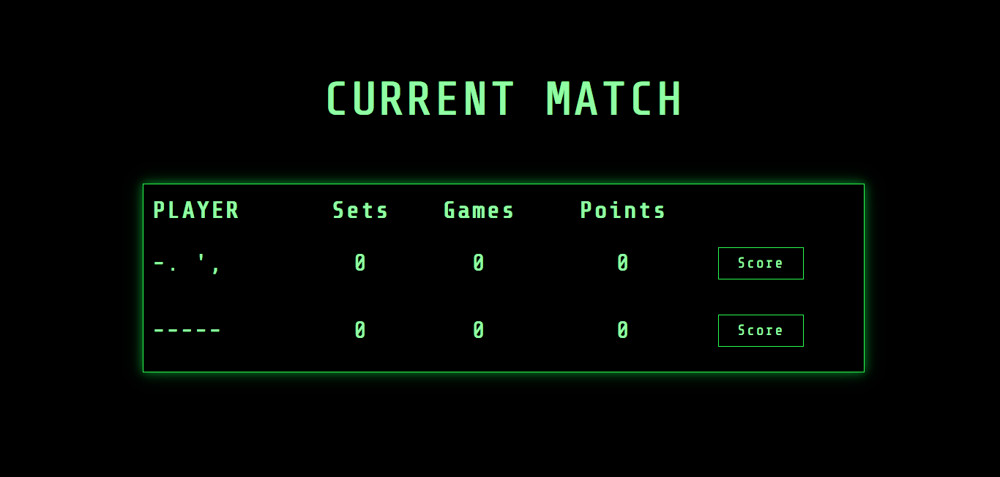
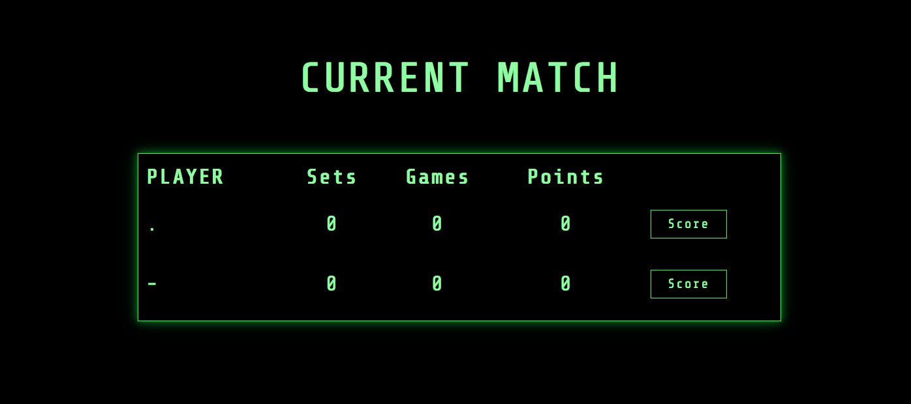
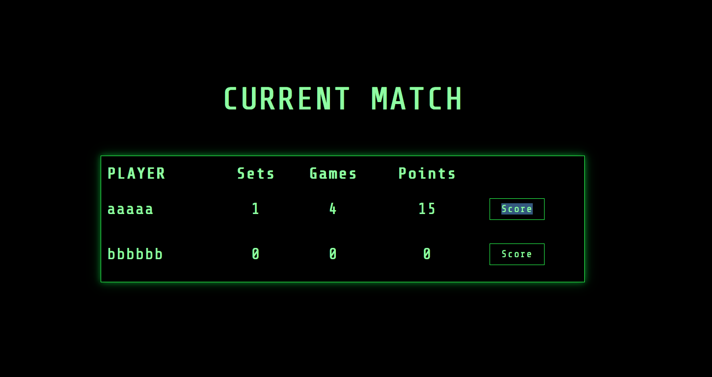
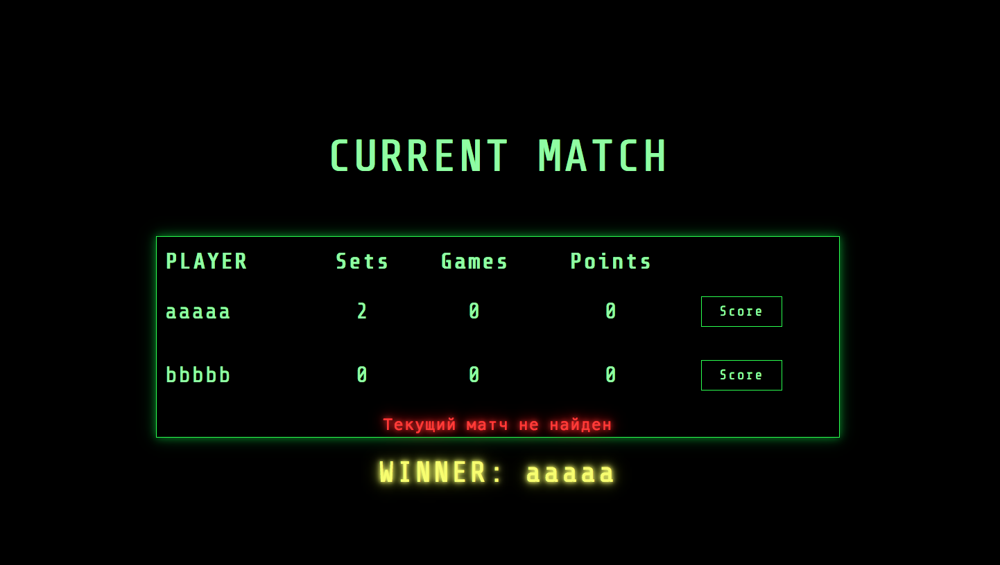
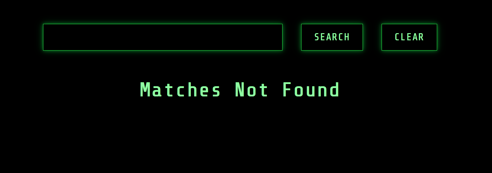

```text
Знаком ❗️ помечены критически важные замечания, а также места нарушения ТЗ.
```

## Функциональный обзор

- Сейчас можно создать игроков с такими именами:




Раз в проекте есть валидация, стоит добавить проверку, что в имени есть буквы и ввести другие уместные ограничения.

- Валидировать длину имени стоит после обрезки пробелов по краям. Сейчас можно создать игроков с такими именами:



- Надпись "Score" на кнопках можно выделить как простой текст. Это можно исправить в css.



- После завершения матча стоит сделать кнопки "Score" неактивными.

Сейчас их можно нажимать, что приводит к сообщению об ошибке:



- Последний сыгранный матч отображается последним в списке на странице завершённых матчей — чтобы посмотреть его результат в таблице надо листать до последней страницы. Лучше, чтобы последний завершённый отображался первым в списке (на первой странице).

- При фильтрации по пустой строке сейчас не показывается ни один матч:



Вместо этого можно считать это за отсутствие фильтра и показывать все матчи. 

- Когда фильтр по имени не применён, можно не показывать кнопку сброса фильтра

